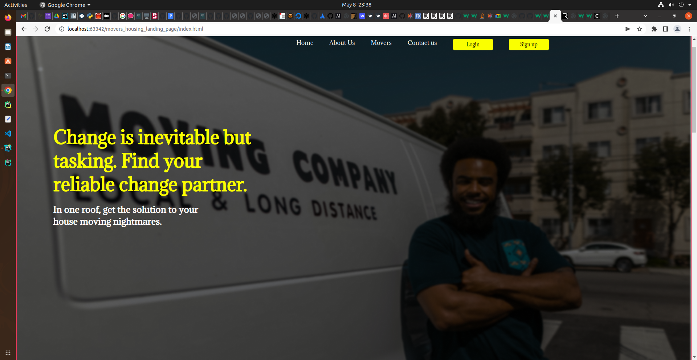
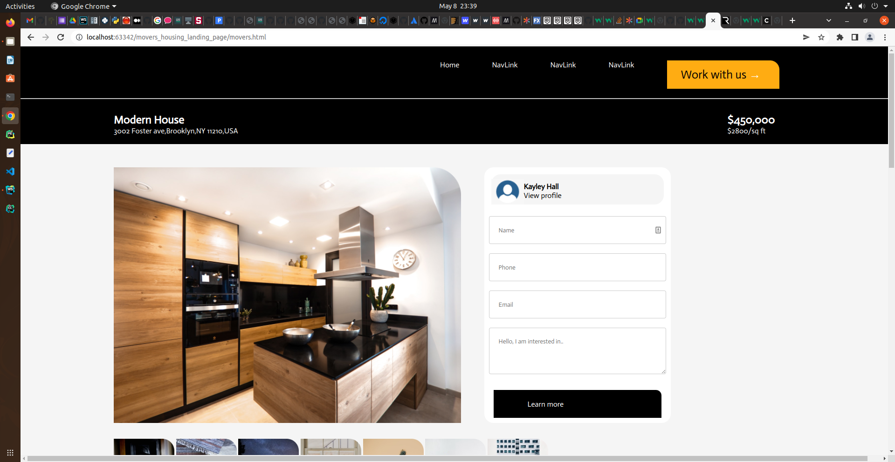

## Name
***
movers_landing_page.

### Page Visuals
***


* page 2


### Table of Content
***
- [Description](#description)
- [Features](#features)
- [Requirements](#requirements)
- [Installation Process](#installation-process)
- [Live Link](#live-link)
- [Technology Used](#technology-used)
- [Contribution](#contribution)
- [Authors Info](#authors-info)
- [Licence](#licence)

### [Description](#description)
***
landing page

### [Features](#features)
***
As a user of the web app,you will be able to :

###  [Requirements](#requirements)
***
* Access to  a computer, smartphone or other devices
* Access to internet

### [Installation Process](#intallation-process)
***
clone this repository either using SSH or HTTPS links provided:
```
git clone git@github.com:eliudkw/movers_landing_page.git

or use

git clone https://github.com/eliudkw/movers_landing_page.git

cd movers_landing_page
```

### [Live Link](#liv-link)
***
- Click this link to view the live application <br>

### [Technology Used](#technology-used)
***
* HTML - which was used to develop the structure of the pages.
* CSS - which was used to style the User Interface.

### [Contribution](#contribution)
***
Contributions to this project are always welcome! and if you have any feedback on the project, please reach out to me.

### [Authors and acknowledgment](#authors-info)
***
* **Eliud Wanja** - [eliudkw](https://github.com/eliudkw)

## License
***
```
Copyright (c) 2022 Eliud Wanja

Permission is hereby granted, free of charge, to any person obtaining a copy
of this software and associated documentation files (the "Software"), to deal
in the Software without restriction, including without limitation the rights
to use, copy, modify, merge, publish, distribute, sublicense, and/or sell
copies of the Software, and to permit persons to whom the Software is
furnished to do so, subject to the following conditions:

The above copyright notice and this permission notice shall be included in all
copies or substantial portions of the Software.

THE SOFTWARE IS PROVIDED "AS IS", WITHOUT WARRANTY OF ANY KIND, EXPRESS OR
IMPLIED, INCLUDING BUT NOT LIMITED TO THE WARRANTIES OF MERCHANTABILITY,
FITNESS FOR A PARTICULAR PURPOSE AND NONINFRINGEMENT. IN NO EVENT SHALL THE
AUTHORS OR COPYRIGHT HOLDERS BE LIABLE FOR ANY CLAIM, DAMAGES OR OTHER
LIABILITY, WHETHER IN AN ACTION OF CONTRACT, TORT OR OTHERWISE, ARISING FROM,
OUT OF OR IN CONNECTION WITH THE SOFTWARE OR THE USE OR OTHER DEALINGS IN THE
SOFTWARE.
```